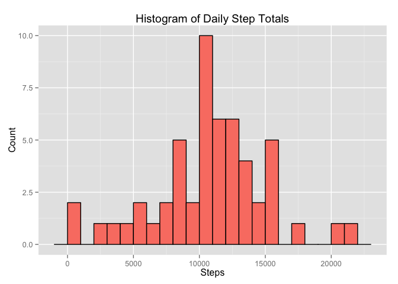
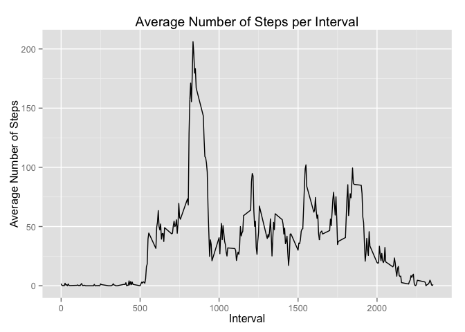
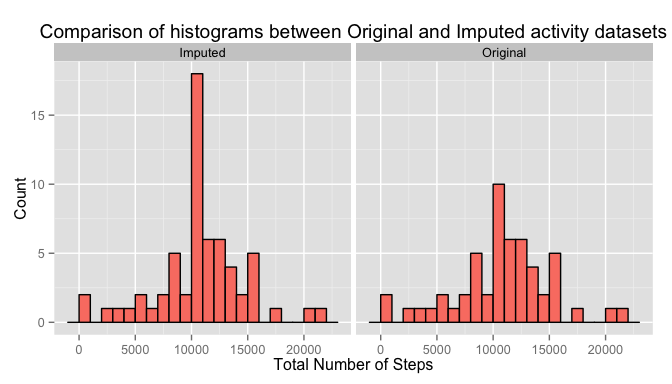
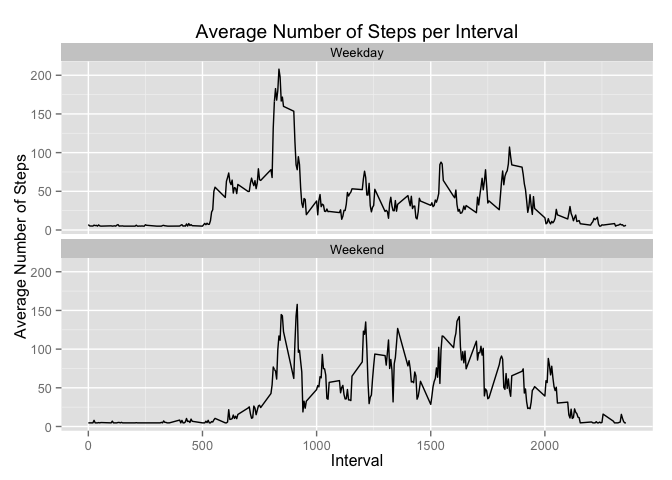

# Reproducible Research: Peer Assessment 1
Lamont Girton  

```r
library(knitr)

opts_chunk$set(fig.path = "figure/")
```

## Loading and preprocessing the data

Below is the code used to download the [data archive][1] and uncompress it to the _data_ directory.


```r
options(digits = 2, scipen = 100)


url <- "https://d396qusza40orc.cloudfront.net/repdata%2Fdata%2Factivity.zip"

if(!file.exists("data/activity.csv")) {
  dir.create("data/")
  download.file(url = url, destfile = "data/activity.zip", method = "curl")
  unzip("data/activity.zip", exdir = "data/")
  file.remove("data/activity.zip")
}
```

Below is the code to read the CSV file into a variable named _activity_ and preprocess the date field from a character/factor to Date type.


```r
activity <- read.csv("data/activity.csv")
activity$date <- as.Date(activity$date)
```

There are 17568 observations of 3 variables in the dataset.

## What is mean total number of steps taken per day?

To summarise the total number of steps per day, I use the _dplyr_ package and group the activity by date and sum the total number of steps for each day.


```r
library(dplyr)

activity_by_date <- activity %>% 
    group_by(date) %>% 
    summarise(steps=sum(steps))
```

Summarizing the data produces a dataset with 61 observations and 2 variables.

The following code generates a histogram of the numbers of daily steps as provided in the summarized dataset.


```r
library(ggplot2)
ggplot(activity_by_date, aes(steps)) +
    geom_histogram(binwidth=1000, fill="salmon", color="black") +
    ggtitle("Histogram of Daily Step Totals") +
    labs(x = "Steps", y = "Count")
```



```r
steps_mean <- mean(activity_by_date$steps, na.rm = T)
steps_medi <- median(activity_by_date$steps, na.rm = T)
```

I also recorded the mean and median steps from this summarized data in the _steps\_mean_ and _step\_median_ variables respectively.  The mean number of steps taken daily is **10766.19** and the median number of steps per day is **10765**.  These values are expressions of the center of the distribution and are very close together, denoting that the distribution doesn't show have much skew to either the left or right of the center.

## What is the average daily activity pattern?

I used the _dplyr_ package again to summarize the activity, taking the mean number of steps taken by _interval_ and generated a plot of these averages across the intervals.


```r
activity_by_interval <- activity %>% 
    group_by(interval) %>% 
    summarise(mean_steps=mean(steps, na.rm = T))

ggplot(activity_by_interval, aes(interval, mean_steps)) +
    geom_line() +
    ggtitle("Average Number of Steps per Interval") +
    labs(x="Interval", y="Average Number of Steps")
```



Below I record the interval with the highest average in the _interval\_max_ variable, as well as the step average for that interval in _steps\_max_.


```r
steps_max <- max(activity_by_interval$mean_steps)
interval_max <- activity_by_interval[activity_by_interval$mean_steps == steps_max, ]$interval
```

From the histogram and taking the maximum of the dataset, we see that the average peaks at interval **835** (roughly 13:10) with an average of **206.17** steps.

## Imputing missing values

Below is the code to calculate the total number of records coded with NA in the _steps_ variable.


```r
num_missing <- nrow(activity[is.na(activity$steps) == TRUE,])
```

The activity.csv dataset contains **2304** records with NA recorded in the _steps_ variable.  The imputation strategy I chose was simply to replace the steps with NA recorded with the mean steps per _interval_ and _date_ and recorded the new dataset in the _activity\_impute_ variable.


```r
activity_impute <- activity
activity_impute[is.na(activity_impute$steps), ]$steps <- mean(activity_impute$steps, na.rm = T)
```

I combined (row-wise) the imputed activity dataset with the original activity dataset to make side-by-side plotting easier in _ggplot2_ and summarize the total numbers of steps by the datasets (Original and Imputed) and date.


```r
activity_combined <- rbind(activity %>% mutate(type="Original"), activity_impute %>% mutate(type="Imputed"))

activity_combined_by_date <- activity_combined %>% 
    group_by(type,date) %>% 
    summarise(Steps=sum(steps))
```

Below is the histogram faceted on the Imputed and Original datasets.


```r
ggplot(activity_combined_by_date, aes(Steps)) +
    geom_histogram(binwidth=1000, fill="salmon", color="black") +
    facet_wrap(~type) +
    ggtitle("Comparison of histograms between Original and Imputed activity datasets") +
    labs(x = "Total Number of Steps", y = "Count")
```



The imputed dataset has a greater number of instances around the center of the distribution than the original and this was expected as I introduced some bias by using the mean estimate in replacing the missing values.

The mean of the imputed dataset is **10766.19** and is identical to the mean computed on the non-imputed dataset **10766.19**.  The median is **10766.19** in the imputed dataset, while the original was **10765**.  This difference was introduced because we biased the dataset toward the mean.

## Are there differences in activity patterns between weekdays and weekends?

Below is the code snippet that was used to introduce new field, _day\_type_ to capture whether the day was a "Weekend" or "Weekday".  The code also summarizes the mean steps per interval and by day_type (again, using functions from the _dplyr_ package).


```r
activity_by_interval_day <- activity_impute %>%
    mutate(day_type=ifelse(weekdays(date, abbrev = T) %in% c("Sun", "Sat"), "Weekend", "Weekday")) %>% 
    group_by(day_type, interval) %>% 
    summarise(mean_steps=mean(steps, na.rm = T))
```

Below are the line charts for the mean steps by interval and day type.  As illustrated in the plots, there are differences in the average number of steps taken during different times throughout the day.


```r
ggplot(activity_by_interval_day, aes(interval, mean_steps)) +
    geom_line() +
    facet_wrap(~day_type, ncol = 1)+
    ggtitle("Average Number of Steps per Interval") +
    labs(x="Interval", y="Average Number of Steps")
```



[1]: https://d396qusza40orc.cloudfront.net/repdata%2Fdata%2Factivity.zip "data"
